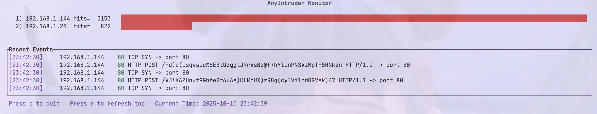

# AnyIntruder

基于 libpcap 的实时网络入侵监控工具（支持 Linux / macOS / FreeBSD / Windows via Npcap）



实时抓包并可视化展示 TCP 流量中的常见扫描与攻击尝试，支持 HTTP / HTTPS / SSH / SYN 等流量摘要与事件统计。UI 使用终端界面（ncurses），适合在服务器或研究环境里快速观测网络异常。

> 要点：抓包通常需要 root 权限或等效 capability（Linux 可用 `setcap` 赋能）。

---

## 亮点一览

* 实时解析 HTTP 请求行并展示摘要
* 对 HTTPS 尝试提取 ClientHello 的 SNI 信息（后续数据标注为 [ENCRYPTED/BINARY]）
* 环形事件缓冲，超出即覆盖最旧事件
* 轻量 CLI，可选把告警发送到第三方平台（Telegram 等）
* 支持主流类 Unix 系统，Windows 可通过 Npcap 支持

---

## 快速开始

### 列出可用网络接口

```bash
# Linux / macOS 通用方式（tcpdump 必须安装）
sudo tcpdump -D

# macOS 也可
ifconfig -a
```

### 运行示例（使用短/长参数）

```bash
# 短参数
sudo ./anyintruder -i en0 -s telegram

# 长参数
sudo ./anyintruder --interface=en0 --sendto=telegram
```

行为说明：`-s` 或 `--sendto` 为可选带值参数，如果用户只写了 `-s` 而没有值，程序会忽略该选项并继续正常运行，消息发送逻辑由别的模块在运行时决定。

---

## 支持的平台（Webhook / Bot）

AnyIntruder 支持多种即时通信与协作平台，通过 Webhook 或 Bot API 实时推送网络入侵告警。
所有发送逻辑集中于 `platform_webhook.c`，可统一配置并扩展。

| 平台名 (参数值)  | 类型      | 描述                                     |
| ---------- | ------- | -------------------------------------- |
| `telegram` | Bot API | 通过 Telegram Bot 推送消息到群组或频道             |
| `slack`    | Webhook | 使用 Slack Incoming Webhook 发送 JSON 格式通知 |
| `discord`  | Webhook | 兼容 Discord 官方 Webhook API              |
| `msteams`  | Webhook | 支持 Microsoft Teams Connector 格式        |
| `dingtalk` | Webhook | 钉钉机器人消息推送                              |
| `wechat`   | Webhook | 企业微信自定义机器人接口                           |
| `feishu`   | Webhook | 飞书群机器人接口                               |


---

## 快速制造测试事件（开发调试小技巧）

在另一个终端启动简单 HTTP 服务并触发请求：

```bash
python3 -m http.server 8000
curl http://127.0.0.1:8000
ssh -p 22 127.0.0.1   # 触发本机 SSH 尝试
```

如果抓取回环接口（lo / lo0），运行 AnyIntruder 时请指定回环接口。

---

## 平台依赖与安装

### Linux (Debian / Ubuntu)

```bash
sudo apt update
sudo apt install build-essential pkg-config libpcap-dev libncurses-dev
```

接口示例：`lo`, `eth0`, `wlan0`, `docker0`, `any`（Linux 专用）

### macOS (Homebrew)

```bash
brew install pkg-config libpcap ncurses
export PKG_CONFIG_PATH="/opt/homebrew/opt/libpcap/lib/pkgconfig:$PKG_CONFIG_PATH"
```

接口示例：`lo0`, `en0`, `en1`, `awdl0`

### FreeBSD

通常自带 libpcap，若缺少可用 `pkg` 安装 ncurses 等。接口示例：`lo0`, `em0`

### Windows

原生 Windows 请安装 Npcap 并以管理员运行。开发时也可以考虑在 WSL2 内运行 Linux 版本。

---

## 构建与编译

项目使用标准 Makefile 或 CMake。下面给出最简单的 gcc 编译参考：

```bash
# 从仓库根目录
gcc -Iincludes src/*.c src/webhook/*.c any_intruder.c -o build/any_intruder -lcurl
```
或

```bash
sudo make
```

或者使用 CMake（推荐长期维护）：

```bash
mkdir -p build
cd build
cmake ..
make
```

---

## 配置示例（config.yaml）

放在项目根目录，轻量 YAML 用法示例：

```yaml
telegram:
  bot_token: 7958021051:YOUR_TOKEN_HERE
  chat_id: -1001700768700
```

说明：仓库内提供 `config.example.yaml`，请基于该文件填写实际配置。生产环境请使用 secrets 管理，不要把 token 推到远程仓库。

---

## 调试与开发提示

* 使用 `tcpdump` 验证接口是否有流量：

```bash
sudo tcpdump -i en0 tcp port 80
```

* 在 `monitor.c` 的 `got_packet` 回调加临时 debug 输出以快速排查：

```c
fprintf(stderr, "got_packet len=%u\n", header->len);
```

* 可注入测试事件来验证 UI 渲染与日志功能，避免每次都真实抓包调试。

---

## 使用示例：典型启动流程

```bash
# macOS 启动并指定接口
sudo ./anyintruder --interface=en0

# macOS 并请求发送到 Telegram（发送逻辑在别处实现）
sudo ./anyintruder --interface=en0 --sendto=telegram

# Linux 全接口（Linux-only）
sudo ./anyintruder --interface=any
sudo ./anyintruder --interface=any --sendto=wechat
```

---

## 贡献指南

欢迎 PR 与 Issue。基本流程：

1. Fork 仓库
2. 新建分支 `git checkout -b feature/YourThing`
3. 提交修改 `git commit -m "feat: describe"`
4. Push 并发起 PR

---

## 作者信息

* 项目作者: ctkqiang
* GitHub：[https://github.com/ctkqiang](https://github.com/ctkqiang)
* Gitcode：[https://gitcode.com/ctkqiang_sr](https://gitcode.com/ctkqiang_sr)
* 个人博客：[https://www.ctkqiang.xin](https://www.ctkqiang.xin)
* 反馈邮箱：[ctkqiang@dingtalk.com](mailto:ctkqiang@dingtalk.com)

---

## 开源项目赞助

感谢您使用本项目！您的支持是开源持续发展的核心动力。

* 服务器与基础设施维护
* 新功能开发与版本迭代
* 文档优化与社区建设

## 许可证

本项目采用 **木兰宽松许可证 (Mulan PSL)** 进行许可。  
有关详细信息，请参阅 [LICENSE](LICENSE) 文件。  
（魔法契约要保管好哟~）

[](http://license.coscl.org.cn/MulanPSL2)


### 🌐 全球捐赠通道

#### 国内用户

<div align="center" style="margin: 40px 0">

<div align="center">
<table>
<tr>
<td align="center" width="300">

<br />
<strong>🔵 支付宝</strong>（小企鹅在收金币哟~）
</td>
<td align="center" width="300">

<br />
<strong>🟢 微信支付</strong>（小绿龙在收金币哟~）
</td>
</tr>
</table>
</div>
</div>

#### 国际用户

<div align="center" style="margin: 40px 0">
  <a href="https://qr.alipay.com/fkx19369scgxdrkv8mxso92" target="_blank">
    
  </a>
  
  <a href="https://ko-fi.com/F1F5VCZJU" target="_blank">
    
  </a>
  
  <a href="https://www.paypal.com/paypalme/ctkqiang" target="_blank">
    
  </a>
  
  <a href="https://donate.stripe.com/00gg2nefu6TK1LqeUY" target="_blank">
    
  </a>
</div>

---

### 📌 开发者社交图谱

#### 技术交流

<div align="center" style="margin: 20px 0">
  <a href="https://github.com/ctkqiang" target="_blank">
    
  </a>
  
  <a href="https://stackoverflow.com/users/10758321/%e9%92%9f%e6%99%ba%e5%bc%ba" target="_blank">
    
  </a>
  
  <a href="https://www.linkedin.com/in/ctkqiang/" target="_blank">
    
  </a>
</div>

#### 社交互动

<div align="center" style="margin: 20px 0">
  <a href="https://www.instagram.com/ctkqiang" target="_blank">
    
  </a>
  
  <a href="https://twitch.tv/ctkqiang" target="_blank">
    
  </a>
  
  <a href="https://github.com/ctkqiang/ctkqiang/blob/main/assets/IMG_9245.JPG?raw=true" target="_blank">
    
  </a>
</div>

---

致极客与未来的你

> "世界由代码驱动，安全靠你我守护。"

无论你是网络安全研究员、CTF 挑战者、自由极客，还是热爱数学与工程的探索者，这个项目都向你敞开怀抱。
欢迎你 fork、魔改、重构、注入灵感，它是工具，也是信仰。

